# MapCalibration

The MapCalibration app's aim is to assist satnav-based navigation for
maps without GPS coordinates. The main idea is to calibrate the map by
setting reference markers on a satellite photo map, in locations easy to
identify on both maps. Then, the app computes the map scale. From now
on, an user can identify locations on the calibrated map by measuring
distances from reference markers. In detail, there are the following
types of markers (colors correspond to colors of respective markers):


* <span style="color:red">reference marker</span> - specified by the
  marker on the photo map or gps coordinates. 

*  <span style="color:orange">reference scale marker</span> - specified by placing a marker on
   the photo map and giving the distance from the reference pin marker


The scale of the map can be also typed explicitly. 

When the scale of the map is known, we can specify points we would like
to find in the terrain:

* <span style="color:green">target xy marker</span> - specified as a
  horizontal and vertical distance from another marker

*  <span style="color:blue">target 2-line marker</span> - exact
   measuring of horizontal and vertical distances is not easy outdoors.
   It is much easier to measure distances between points. A target
   2-line marker is specified by giving the distances from any two
   markers. Moreover, also it must be specified on which side of the
   line connecting the reference points the intended location is
   positioned.


Every marker (either reference or target) can be selected as a target
for navigation. The app shows the distance and heading to this marker.


The app requires a network connection for showing the map.

The set of all markers currently defined can be saved. loaded


## Example


1. The map we use

Assume that we are given the following map.

<p align="center"> 
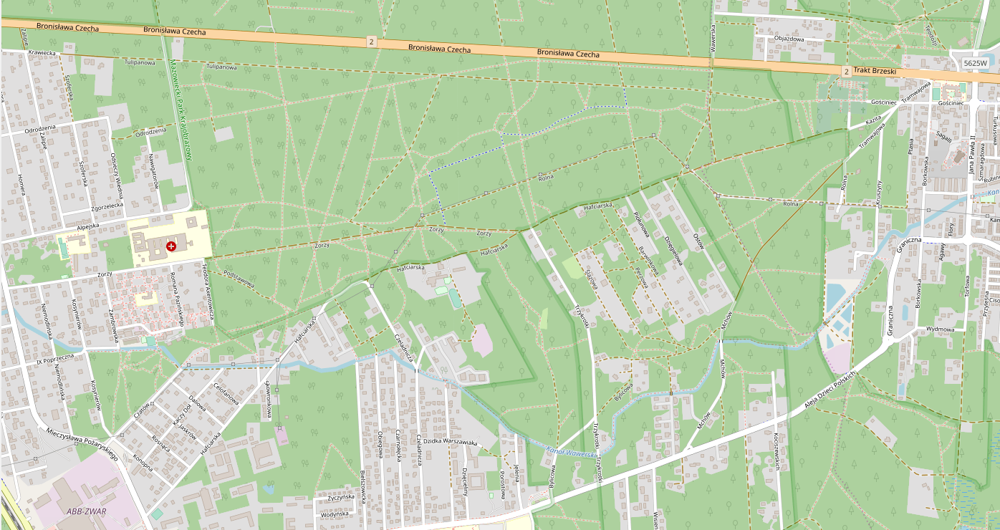
</p>

The units we use for measuging distances are relevant only for the scale
(proportion of distance on the map and distance in the terrain). When we
do not care about the scale, we can use any units (pixels, centimeters,
milimeters, inches, etc).

2. The reference point

We choose the first reference point at the crossroad (a location easy to
identify both on the map and in the sat photo). First we set a marker:

<p align="center"> 
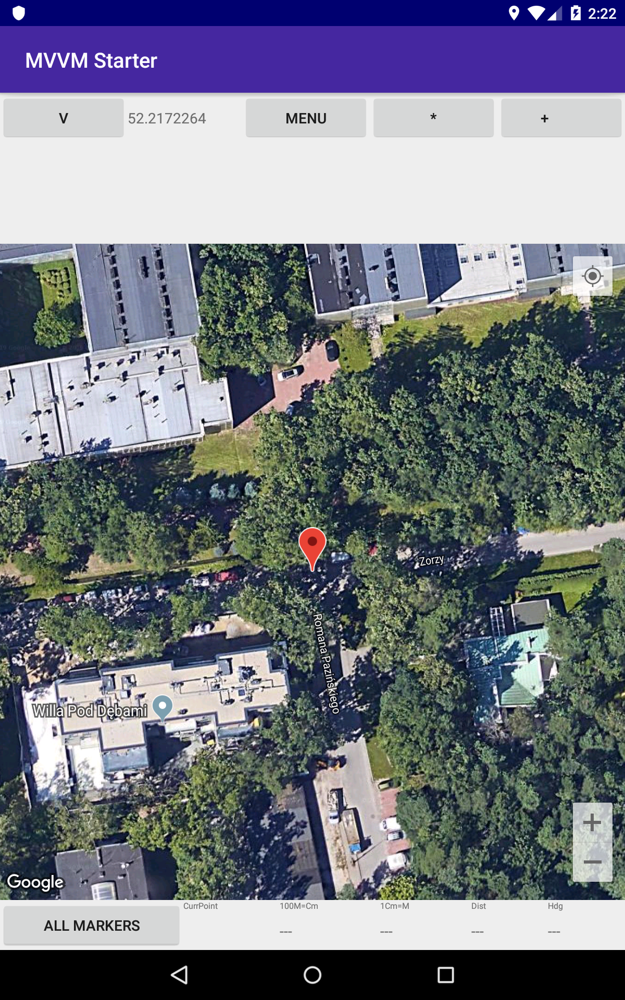
</p>

The corresponding point can be then defined:

<p align="center">
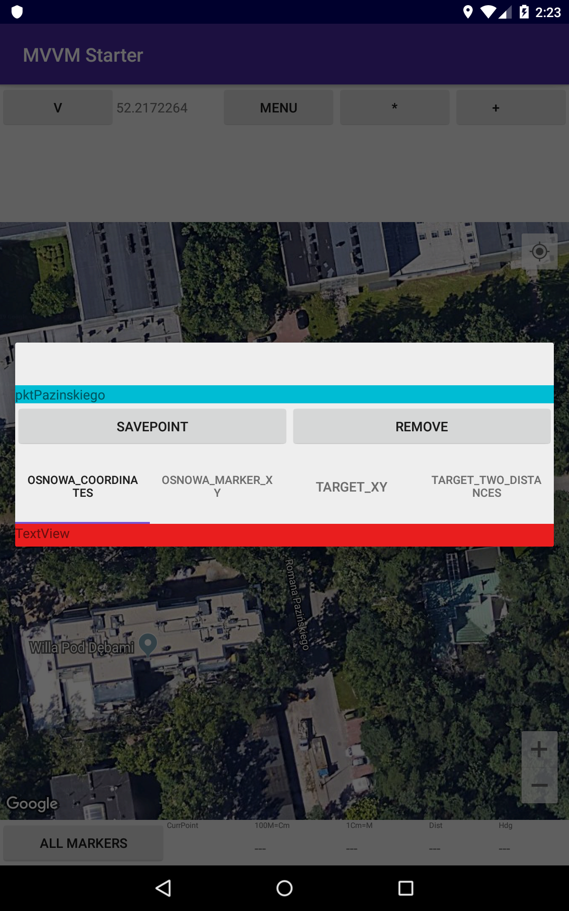
</p>

After setting the first point the displayed map looks as follows:

<p align="center">
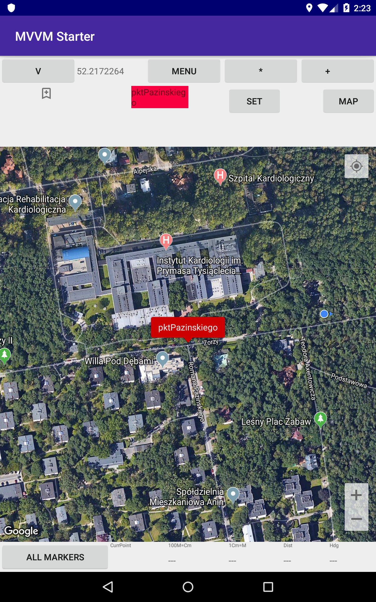
</p>

The point is shown on the map and listed on the list of navigation
points.

3. Reference scale marker

Now we add a GPS point for establishing the map scale. We choose a
corner of a pond by setting a marker and measuring the distance to QQQ
on the map:

<p align="center">
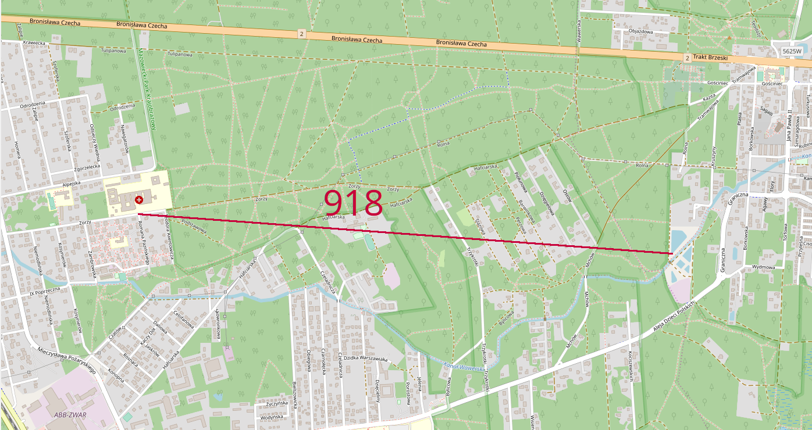
</p>

First we need to set a marker in the chosen location:

<p align="center">
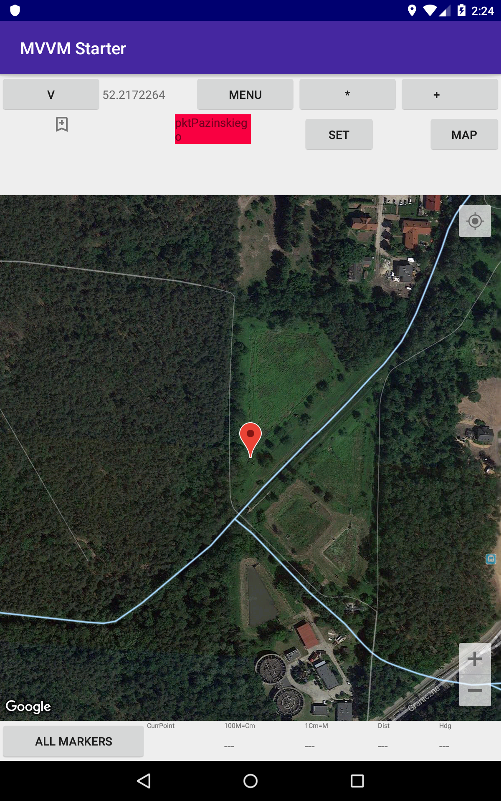
</p>

Then type the measured distance:

<p align="center">
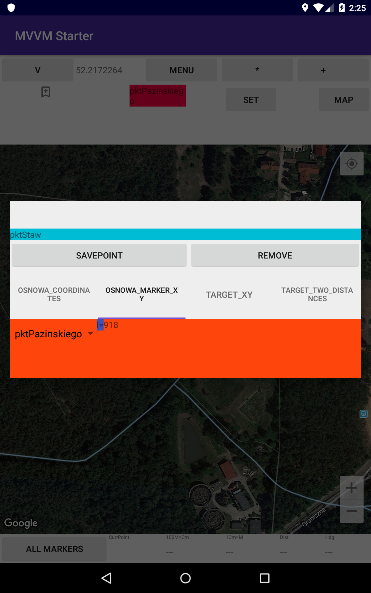
</p>

After adding the point the scale of the map is computed and displayed:

<p align="center">
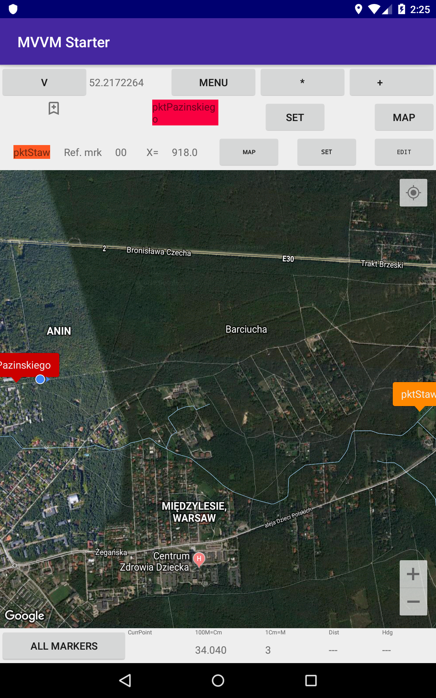
</p>


4. Target point 2-line:

Now, after establishing the map's scale, we want to find a location with
respect to the reference points. Let it be one of the turns of a power
line.

The lines on the
map show the distances measured from two reference points:

<p align="center">
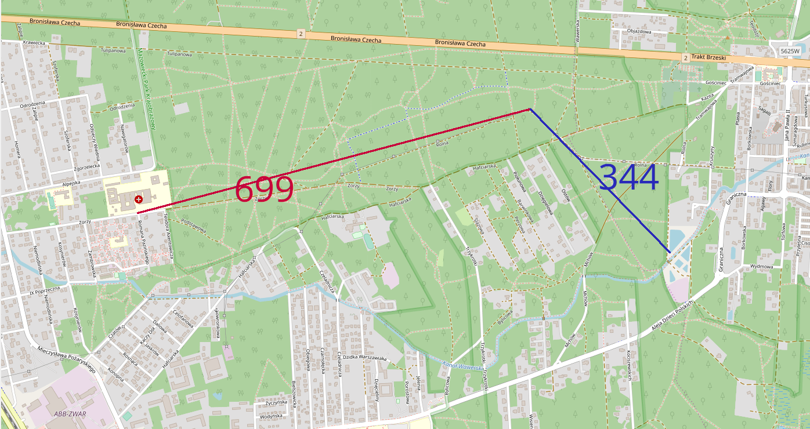
</p>


A target point is defined with respect to this data:

<p align="center">
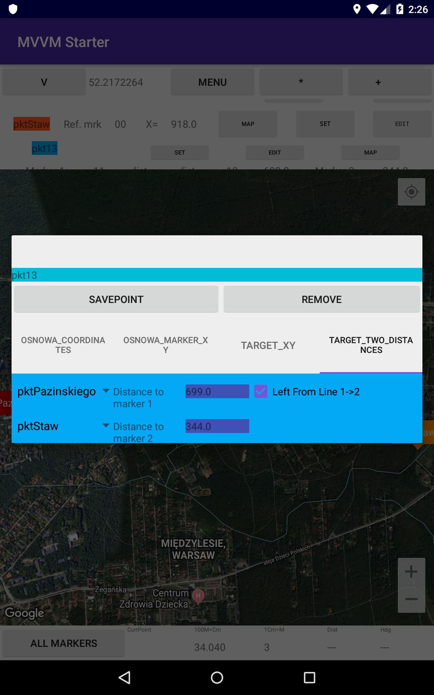
</p>

As we can see, the point is found with the accuracy of just few meters.

<p align="center">
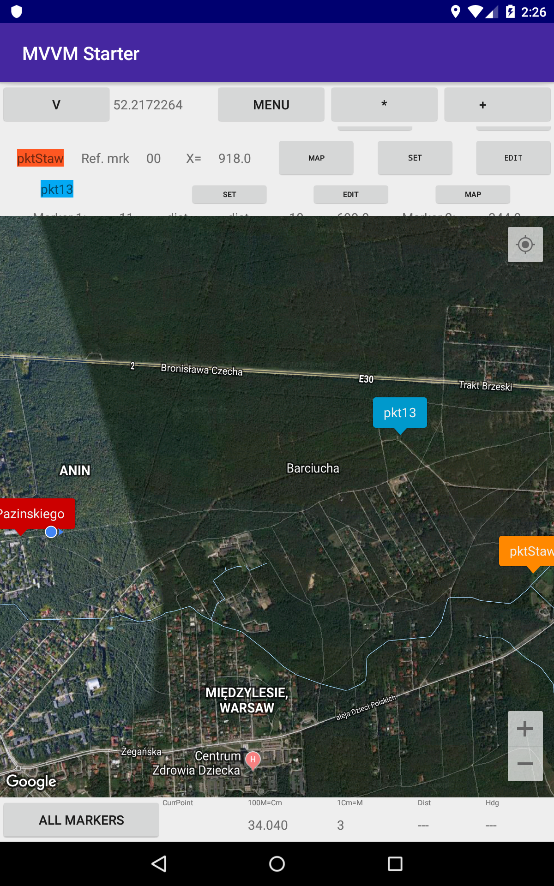
</p>

5. Selecting the target point

<p align="center">
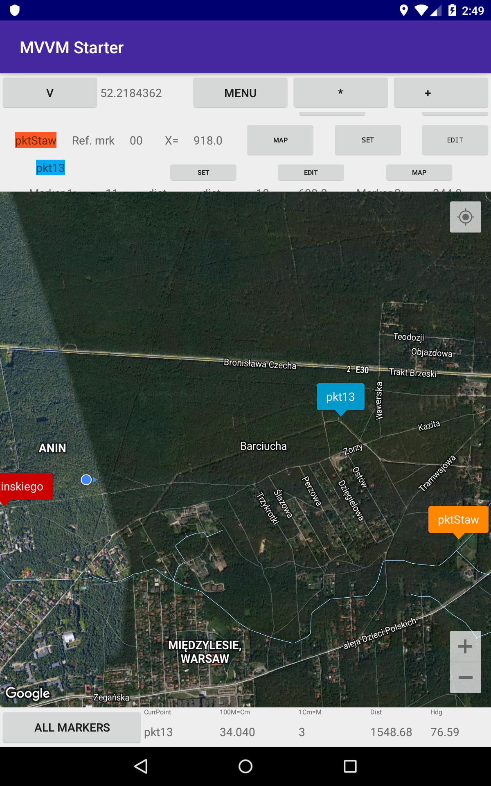
</p>


## Storing points in the phone's persistent memory
 

## Configuration

### TODO:

* offline satellite phtotomap
* adding maps as images (possibly scanned)
* displaying information on an android watch


# MVVMArchitecture

[](http://developer.android.com/index.html)

My way to MVVM pattern using RxJava, LiveData, Room, Paging with the Android databinding
<br/>
<br/>

## What is MVVM pattern?
MVVM is an architectural pattern that was created to simplify user interface programming. 
Google appears to be encouraging the use of MVVM for data binding. 
In fact, the Architecture Components of its Data Binding Library are modeled on the MVVM pattern.


<br/>

## Samples
### Activity Layout File
```xml
    <data>
        <variable name="vm" type="com.leopold.mvvm.viewmodel.search.SearchViewModel"/>
    </data>
    
    <androidx.appcompat.widget.AppCompatImageButton
        android:id="@+id/search_button"
        android:layout_width="48dp"
        android:layout_height="48dp"
        android:src="@drawable/ic_search"
        android:background="?attr/selectableItemBackgroundBorderless"
        android:onClick="@{() -> vm.search()}"
        app:layout_constraintTop_toTopOf="parent"
        app:layout_constraintRight_toRightOf="parent"
        app:layout_constraintLeft_toRightOf="@+id/search_edit"/>
```

### Set Up the ViewModel
```Kotlin
    override fun onCreate(savedInstanceState: Bundle?) {
        super.onCreate(savedInstanceState)

        val binding = DataBindingUtil.setContentView<ActivitySearchBinding>(this, R.layout.activity_search)
        binding.vm = getViewModel()
        binding.setLifecycleOwner(this)
    }
```

### RecyclerView Adapter Item Layout File
```xml
    <data>
        <variable name="item" type="com.leopold.mvvm.data.remote.domain.Repository"/>
        <variable name="vm" type="com.leopold.mvvm.viewmodel.search.SearchViewModel"/>
    </data>
    
    <androidx.appcompat.widget.AppCompatTextView
        android:id="@+id/repository_item_name"
        android:layout_width="wrap_content"
        android:layout_height="wrap_content"
        android:layout_marginStart="6dp"
        android:text="@{item.name}"
        app:layout_constraintTop_toTopOf="parent"
        app:layout_constraintBottom_toBottomOf="parent"
        app:layout_constraintLeft_toLeftOf="parent"/>
```

### DataBinding in ViewHolder
```kotlin
    override fun onBindViewHolder(holder: RepositoryViewHolder, position: Int) {
        holder.binding.item = items[position]
        holder.binding.vm = vm
    }
    
    class RepositoryViewHolder(view: View) : RecyclerView.ViewHolder(view) {
        val binding: LayoutRepositoryItemBinding = LayoutRepositoryItemBinding.bind(view)
    }
```
<br/>

## Libraries

### Android Jetpack

* [DataBinding](https://developer.android.com/topic/libraries/data-binding/) Declaratively bind observable data to UI elements.

* [Lifecycle](https://developer.android.com/topic/libraries/architecture/lifecycle) Create a UI that automatically responds to lifecycle events.

* [LiveData](https://developer.android.com/topic/libraries/architecture/livedata) Build data objects that notify views when the underlying database changes.

* [ViewModel](https://developer.android.com/topic/libraries/architecture/viewmodel) Store UI-related data that isn't destroyed on app rotations. Easily schedule asynchronous tasks for optimal execution.

* [Room](https://developer.android.com/topic/libraries/architecture/room) Access your app's SQLite database with in-app objects and compile-time checks.

* [Paging](https://developer.android.com/topic/libraries/architecture/paging/) Makes it easier for you to load data gradually and gracefully within your app's RecyclerView.

### HTTP

* [Retrofit2](https://github.com/square/retrofit) Type-safe HTTP client for Android and Java by Square, Inc.

* [OkHttp](https://github.com/square/okhttp) An HTTP+HTTP/2 client for Android and Java applications.

### ReactiveX

* [RxJava2](https://github.com/ReactiveX/RxJava) A library for composing asynchronous and event-based programs using observable sequences for the Java VM

* [RxAndroid](https://github.com/ReactiveX/RxAndroid) RxJava bindings for Android

### DI

* [Koin](https://insert-koin.io/) A pragmatic lightweight dependency injection framework for Kotlin developers.
<br/>

## References

* [Understanding the basics of MVVM design pattern](https://blogs.msdn.microsoft.com/msgulfcommunity/2013/03/13/understanding-the-basics-of-mvvm-design-pattern/)
* [Data Binding Library](https://developer.android.com/topic/libraries/data-binding/)
<br/>

License
-------

    Copyright 2019 Maciej Szreter

    Licensed under the Apache License, Version 2.0 (the "License");
    you may not use this file except in compliance with the License.
    You may obtain a copy of the License at

       http://www.apache.org/licenses/LICENSE-2.0

    Unless required by applicable law or agreed to in writing, software
    distributed under the License is distributed on an "AS IS" BASIS,
    WITHOUT WARRANTIES OR CONDITIONS OF ANY KIND, either express or implied.
    See the License for the specific language governing permissions and
    limitations under the License.
